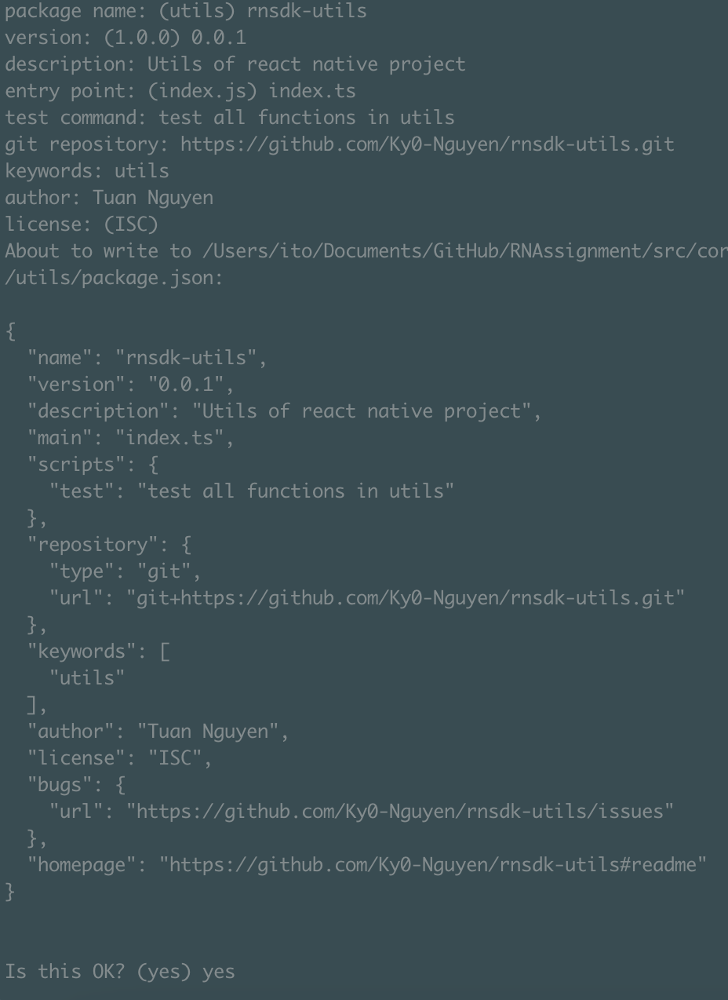
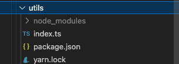
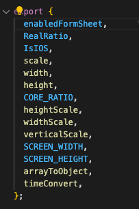
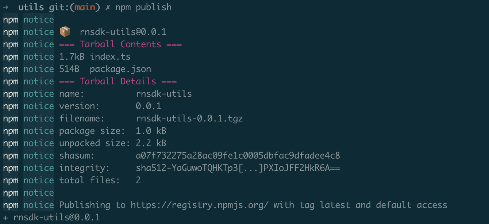
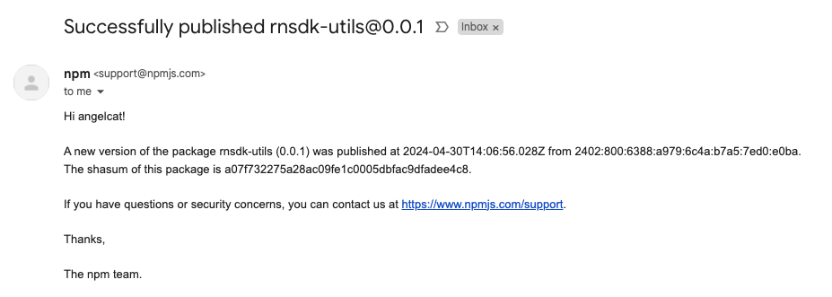
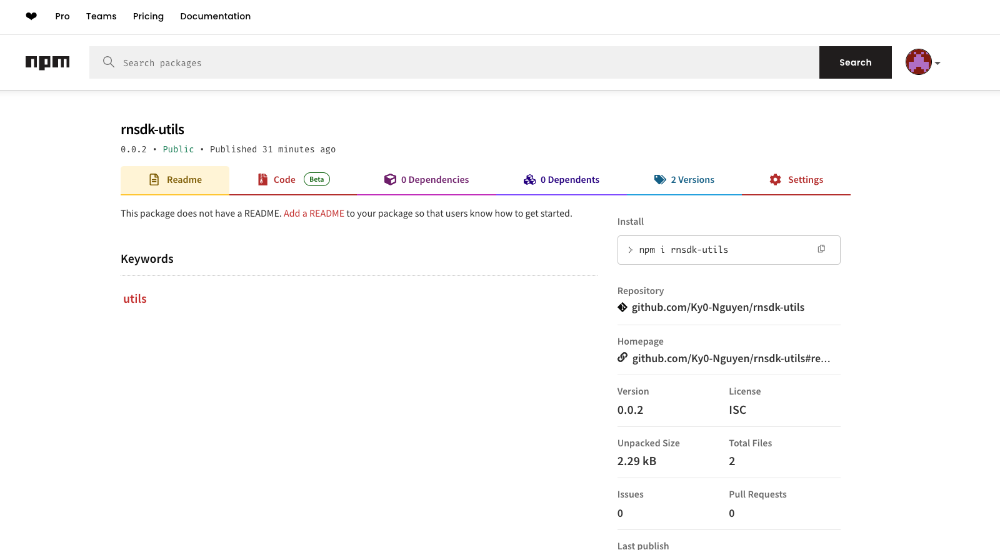

For the bonus features:

# Getting Started

## Q1: SDK Usage in React Native Project:

Develop a Software Development Kit (SDK) tailored for React Native.

Provide comprehensive documentation on how to install and use the SDK in React Native projects.

Include sample code snippets and examples demonstrating the usage of various SDK features.

```bash
# using npm
npm install <your-sdk-package-name> 
#OR
npm install <path-to-sdk>

# OR using Yarn
yarn add <your-sdk-package-name>
#OR
yarn add <path-to-sdk>


#for using in this code with ES6
import {} from "<your-sdk-package-name>"
#OR
import PackageName from "<your-sdk-package-name>"
```

## Q2: Create a New Module for Your SDK:

Create a new directory for your SDK within your React Native project.

Inside this directory, create a JavaScript file for each module or feature of your SDK.

Follow with step:
>**Note**: Make sure you have completed the [NodeJS] 
If you do not already have Node installed, you should go ahead and install it. You can visit the official website to download and install Node.js. NPM comes pre-installed with Node.


### Step 1: Initialize a Git Repository

```bash
# Create a new project folder for your package and navigate into the folder. Then, run the following command in your terminal:
git init

```

### Step 2: Initialize NPM in Your Project

```bash
# To do this, navigate to the root directory of your project and run the following command:
npm init

```

This command will create a package.json file. You will get prompts to provide the following information:

[package-name]: As you learned earlier in this tutorial, the name of your package must be unique. Also it must be lowercase. It may include hyphens.
[version]: The initial value is 1.0.0. You update the number when you update your package using semantic versioning.
[description]: You can provide a description of your package here. Indicate what your package does and how to use it.
[entry point]: The entry file for your code. The default value is index.js.
[test command]: Here, you can add the command you want to run when a user runs npm run test.
[git repository]: The link to your remote repository on GitHub.
[keywords]: Add relevant keywords that will help others find your package on the NPM registry.
[author]: Add your name.
[license]: You can add a license or use the default license (Internet Systems Consortium (ISC) License).

See the screenshot below for an example of how to answer the prompt questions:


### Step 3: Add Your Code

Now, you can go ahead and add the code for your package.

First, you need to create the file that will be loaded when your module is required by another application. For this tutorial, that will be the [index.ts] file.

Here I am using the index file in the utils folder to create a package for it, so I will use the code in the index.ts file of utils and additionally create a [package.json] file from the initial steps as follows:




### Step 3: Test Your NPM Package

Testing ensures that your NPM package works as expected. There are many ways to test your package. In this tutorial, you will learn one of the simplest ways of testing.

```bash
# First, navigate to the root of your package project. Then, run the following command:
npm link <name-of-package>

```
### Step 4: Publish Your NPM Package

To publish your package on the NPM registry, you need to have an account. If you don't have an account, visit the NPM sign up page to create one.

After creating the account, open your terminal and run the following command in the root of your package:

```bash
npm login
```

You will get a prompt to enter your [username] and [password]. If login is successful, you should see a message like this:

```bash
Logged in as <your-username> on https://registry.npmjs.org/.
```

You can now run the following command to publish your package on the NPM registry:
```bash
npm publish
```

If all goes well, you should get results similar to the screenshot below:


If you have been following along, then congratulations! You just published your first NPM package.

You can visit the NPM website and run a search for your package. You should see your package show up in the search results.

For example, from the screenshot below, you can see the [rnsdk-utils] package is now available on NPM.


